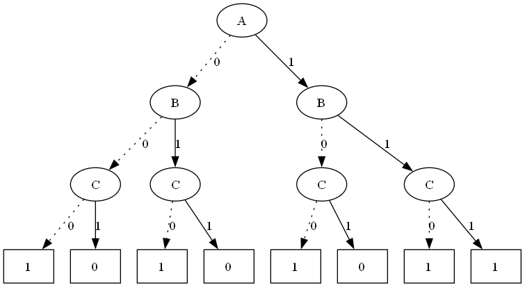
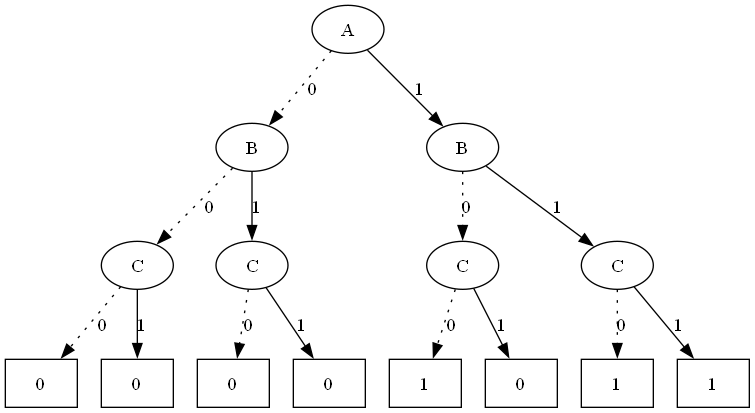
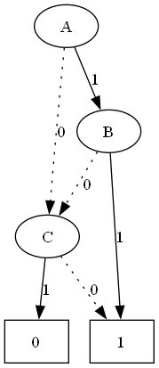
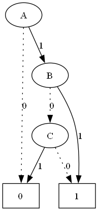

# ROBDD Equivalence Checker

---

## Description

The ROBDD (Reduced Ordered Binary Decision Diagram) Equivalence Checker is a Python-based tool that evaluates the equivalence of two Boolean functions. It builds and visualizes ROBDDs for the given functions and determines whether they are equivalent or not.

---

## Features

- Input two Boolean functions to compare.
- Validate and parse Boolean expressions.
- Construct BDDs and optimize them into ROBDDs.
- Compare ROBDDs for equivalence.
- Visualize BDD and ROBDD diagrams.

---

## Input Format

- **Variables**: `A`, `B`, `C` (case-insensitive).
- **Operators**:
  - `!` for NOT
  - `&` for AND
  - `|` for OR
  - `^` for XOR
- Use parentheses `()` for precedence.

**Example**:  
`A & (B | !C)`  

---

## Example Output

### **BDD Visualization**

### **ROBDD Visualization**

